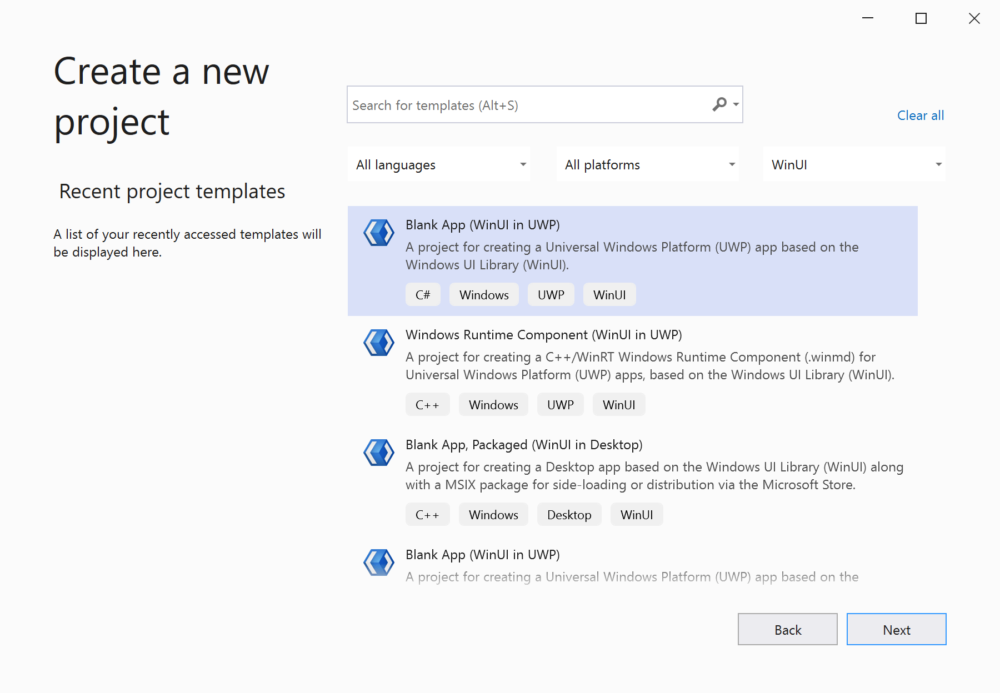
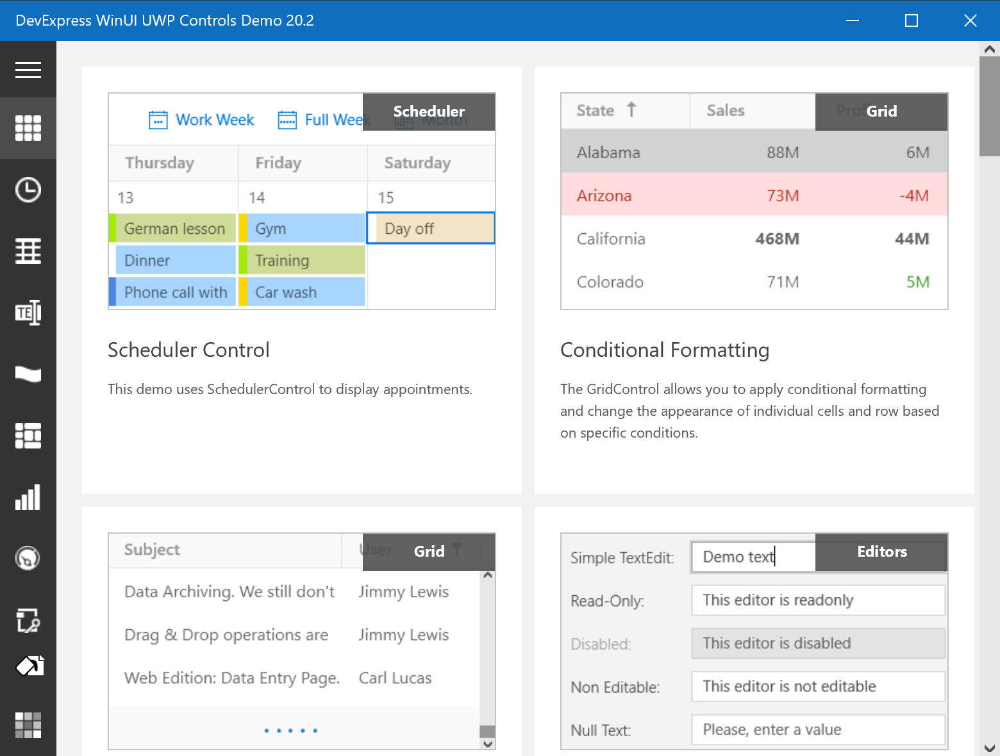
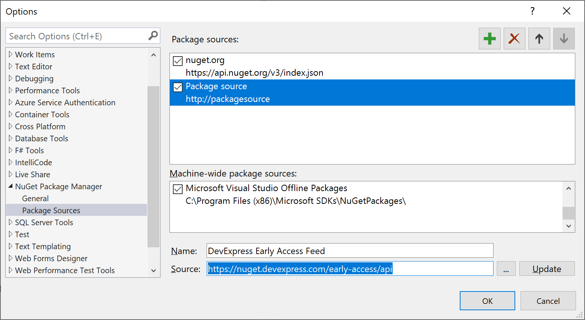
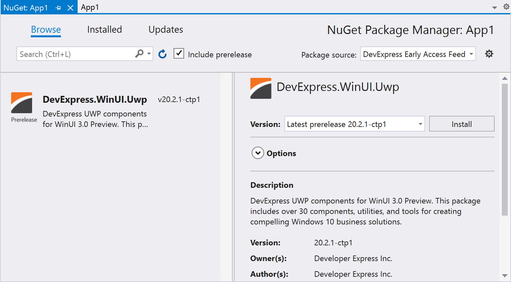

# DevExpress WinUI 3 Demos for UWP

This repository contains WinUI 3 demos with over 30 DevExpress WinUI components and tools, including the Data Grid, Scheduler, Charting, and Navigation.

## Requirements
- Windows 10 April 2018 Update (version 1803 - build 17134) or newer;
- [Visual Studio 2019 Preview](https://visualstudio.microsoft.com/vs/preview), version 16.7 Preview 1 or newer;
- [WinUI 3.0 Preview 1 VSIX extension](https://aka.ms/winui3/previewdownload).

You can find detailed instructions in the following help topic: [Try WinUI 3.0 Preview 1](https://docs.microsoft.com/en-us/windows/apps/winui/winui3/#try-winui-30-preview-1).

## Running Demos

Open and build the demo project. All required NuGet packages will be automatically retrieved by Visual Studio.

    

## Adding DevExpress to a New UWP Project

Open Visual Studio and locate the **Blank App (WinUI in UWP)** template.

    

In the NuGet Package Manager, [register](https://docs.devexpress.com/GeneralInformation/116698/installation/install-devexpress-controls-using-nuget-packages/setup-visual-studios-nuget-package-manager) the DevExpress Early Access NuGet feed.
> https://nuget.devexpress.com/early-access/api

    

Make sure that the **Include prerelease** option is checked and install the **DevExpress.WinUI.Uwp** package.

    

## Documentation

[DevExpress UWP Controls](https://docs.devexpress.com/Win10Apps/212019/windows-10-app-controls)

## Feedback

Your input can help us shape future product offerings for WinUI. Please take a moment to fill out a survey below:

[DevExpress Controls for WinUI 3 Preview - Your Vote Counts](https://community.devexpress.com/blogs/wpf/archive/2020/06/11/devexpress-controls-for-winui-3-preview-are-now-available.aspx#vote)

And feel free to contact us at wpfteam@devexpress.com.

## Copyright

Developer Express Inc. All rights reserved.